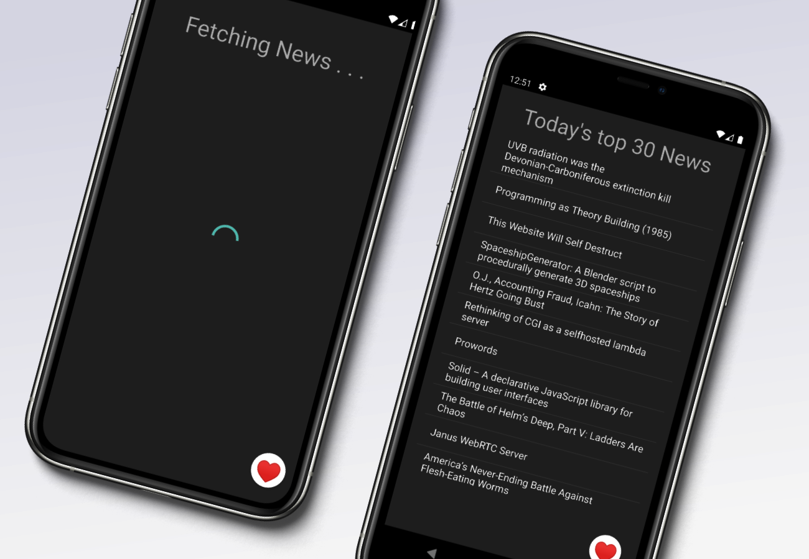

ReNEWS is a news app that selects latest and best top 30 dev news from HackerNews. It provides you a list of the top 30 news. Get updated with the latest news and current affairs in a jiffy!

### Building app with Android Studio

* Clone the repo - `https://github.com/PulkitBanta/News-Reader`
* Open Android Studio and open the project.

## ScreenShots

## Built With

* [Android Studio](https://developer.android.com/) - Android Studio provides the fastest tools for building apps on every type of Android device.
* [Java](https://www.java.com/en/) - ava is a general-purpose programming language that is class-based, object-oriented, and designed to have as few implementation dependencies as possible.
* [HackerNews API](https://github.com/HackerNews/API)

## Coming soon

* New Release with better UI/UX.
* Performance optimizations.

## Download

* [ReNEWS](https://github.com/PulkitBanta/ReNews/releases/tag/1.0.0)

## Contributing

Please read [CONTRIBUTING.md](CONTRIBUTING.md) for details on our code of conduct, and the process for submitting pull requests to us.

## Authors

* **Pulkit Banta** - *Initial work* - [PulkitBanta](https://github.com/PulkitBanta)

## License

This project is licensed under the MIT License - see the [LICENSE](LICENSE) file for details
